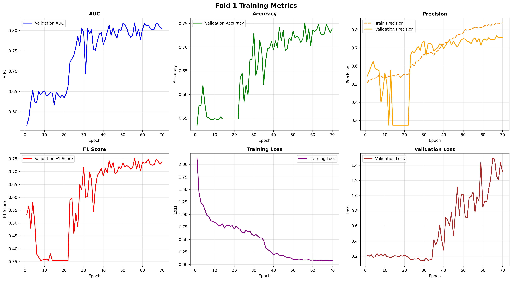
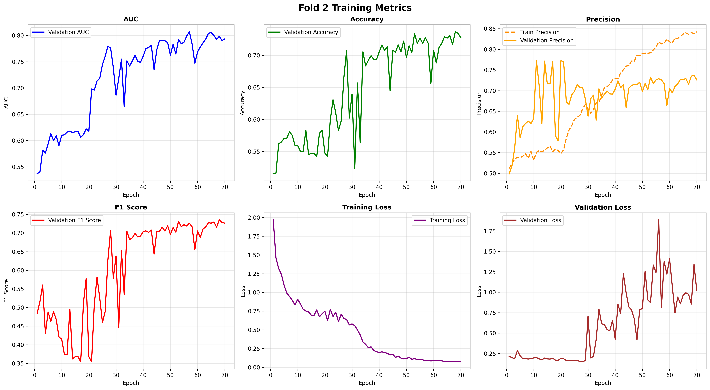
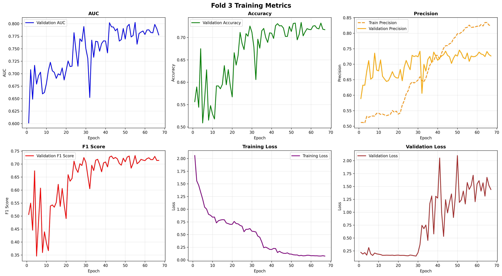
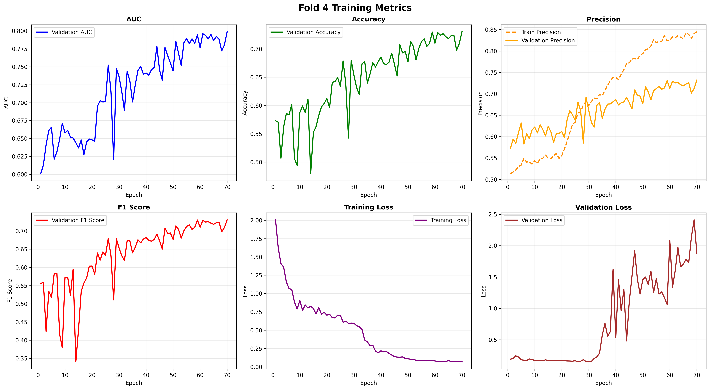
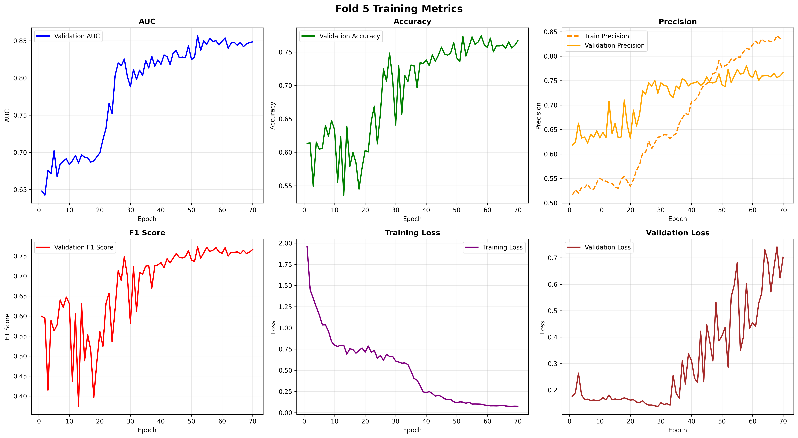

# DualDomainNet for Alzheimer's MRI Classification

DualDomainNet is a deep learning pipeline for binary Alzheimer's disease classification from ADNI MRI slices. The model combines spatial image features from an ImageNet-pretrained ResNet50 with frequency-domain features extracted from FFT log-magnitude images.

> Data note: raw ADNI MRI data, extracted HDF5 slices, subject identifiers, and trained checkpoints are not redistributed because ADNI data is governed by a data use agreement.

## Project Highlights

- Task: classify cognitively normal (CN) vs Alzheimer's disease (AD)
- Data representation: preprocessed 2D coronal MRI slices
- Validation: 5-fold StratifiedGroupKFold with subject-level grouping
- Model: dual-branch spatial and frequency-domain neural network
- Training: progressive unfreezing, focal loss, mixed precision, weighted sampling
- Evaluation: slice-level validation plus subject-level probability voting
- Calibration: post-hoc temperature scaling and Youden threshold analysis

## Architecture


The spatial branch uses a ResNet50 backbone to learn anatomical image features. The frequency branch computes FFT log-magnitude representations and learns complementary texture/frequency cues. The fused representation is passed through batch normalization, dropout, and a two-class classifier.

## Results

Main 5-fold subject-level result:

| Metric | Mean ± SD |
|---|---:|
| Subject AUC | 0.8737 ± 0.0238 |
| Subject Accuracy | 0.7629 ± 0.0567 |
| F1 Score | 0.7569 ± 0.0567 |
| Sensitivity | 0.8249 ± 0.0462 |
| Specificity | 0.7300 ± 0.0879 |

Fold-level subject results:

| Fold | Best Val AUC | Subject Acc | Subject AUC | F1 | Sensitivity | Specificity | N |
|---:|---:|---:|---:|---:|---:|---:|---:|
| 1 | 0.8188 | 0.8649 | 0.9068 | 0.8598 | 0.8333 | 0.8864 | 74 |
| 2 | 0.8069 | 0.7162 | 0.8408 | 0.7098 | 0.8400 | 0.6531 | 74 |
| 3 | 0.8026 | 0.7200 | 0.8533 | 0.7126 | 0.7500 | 0.7021 | 75 |
| 4 | 0.7988 | 0.7297 | 0.8680 | 0.7265 | 0.8214 | 0.6739 | 74 |
| 5 | 0.8569 | 0.7838 | 0.8996 | 0.7758 | 0.8800 | 0.7347 | 74 |

Post-hoc temperature scaling and Youden thresholding improved decision balance:

| Metric | Mean ± SD |
|---|---:|
| TS AUC | 0.8686 ± 0.0277 |
| TS Accuracy | 0.8517 ± 0.0162 |
| TS F1 | 0.8373 ± 0.0212 |
| TS Sensitivity | 0.7702 ± 0.0617 |
| TS Specificity | 0.8980 ± 0.0244 |

The calibrated operating point trades some AD sensitivity for substantially higher CN specificity. In the reported fold averages, specificity increased from 0.7300 to 0.8980 and F1 improved from 0.7569 to 0.8373.


## Training Curves

Fold-level training curves are included to show optimization stability across the subject-level cross-validation splits.

| Fold | Training metrics |
|---:|---|
| 1 |  |
| 2 |  |
| 3 |  |
| 4 |  |
| 5 |  |

## Training Pipeline


Training is organized into three phases:

1. Train the classification head and frequency branch.
2. Unfreeze ResNet layer4.
3. Unfreeze ResNet layer3 and layer4.

The script uses focal loss, AdamW, mixed precision, gradient clipping, early stopping, and subject-level voting.

## Repository Structure

```text
.
├── data/
│   └── README.md
├── docs/
│   ├── architecture_diagram.png
│   ├── pipeline_diagram.png
│   └── training_strategy.png
├── results/
│   ├── confusion_matrix.png
│   ├── cv_metrics_summary.png
│   ├── roc_curve.png
│   └── training_curves/
├── src/
│   └── train_subject_cv.py
├── .gitignore
├── README.md
└── requirements.txt
```

## Usage

Install dependencies:

```bash
pip install -r requirements.txt
```

Run training with an authorized ADNI-derived HDF5 file:

```bash
python src/train_subject_cv.py --hdf5-path /path/to/adcn_slices.h5 --output-dir outputs/dualdomain_v6
```

Optional Weights & Biases logging:

```bash
python src/train_subject_cv.py --hdf5-path /path/to/adcn_slices.h5 --use-wandb
```

## Skills Demonstrated

- Medical image classification
- PyTorch model design and training
- Transfer learning with ResNet50
- FFT-based frequency-domain feature learning
- Subject-level grouped cross-validation
- Model calibration and threshold analysis
- Clinical metrics: AUC, sensitivity, specificity, F1

## Limitations

This repository is intended as a reproducible code and results showcase. Full reproduction requires authorized access to ADNI MRI data and the same preprocessing pipeline used to produce the HDF5 slice file.

- This is a research/portfolio project, not a clinical diagnostic tool.
- Raw MRI data, extracted slices, checkpoints, and MRI-containing preprocessing animations are excluded because of ADNI data-use restrictions.
- Reported calibration results are post-hoc analyses on the existing cross-validation outputs and should be validated on an independent holdout cohort before deployment.
- The current repository focuses on training and aggregate evaluation; preprocessing scripts are described at a high level but ADNI-derived intermediate files are not redistributed.
