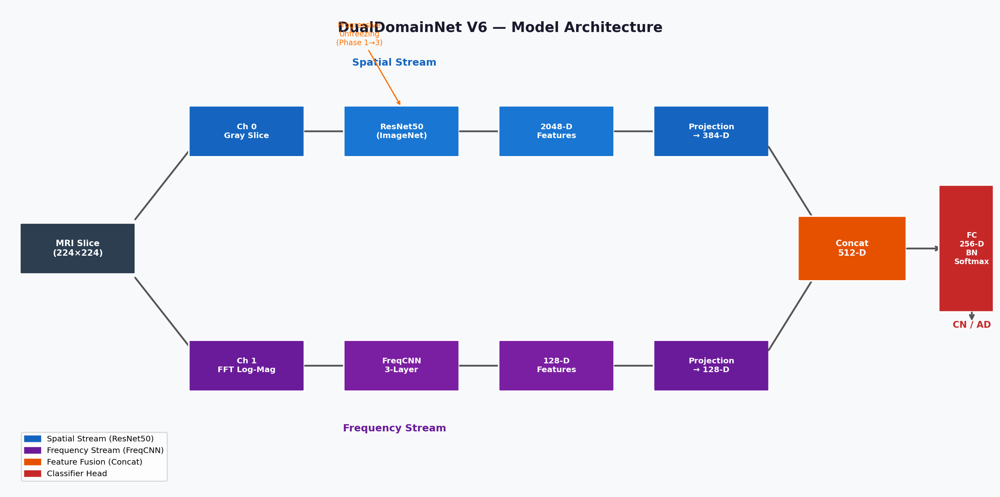
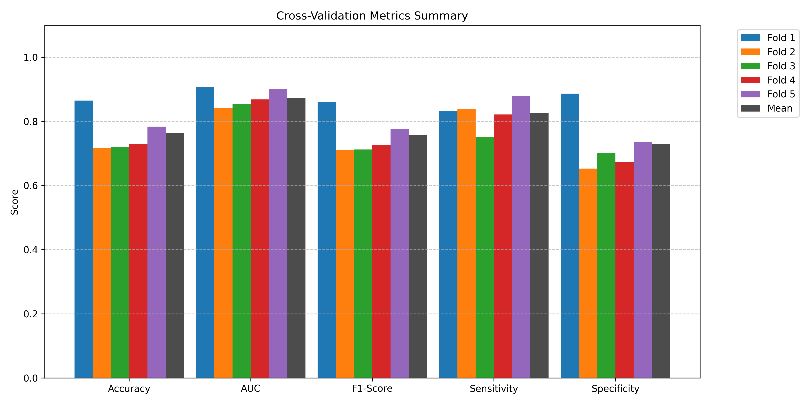
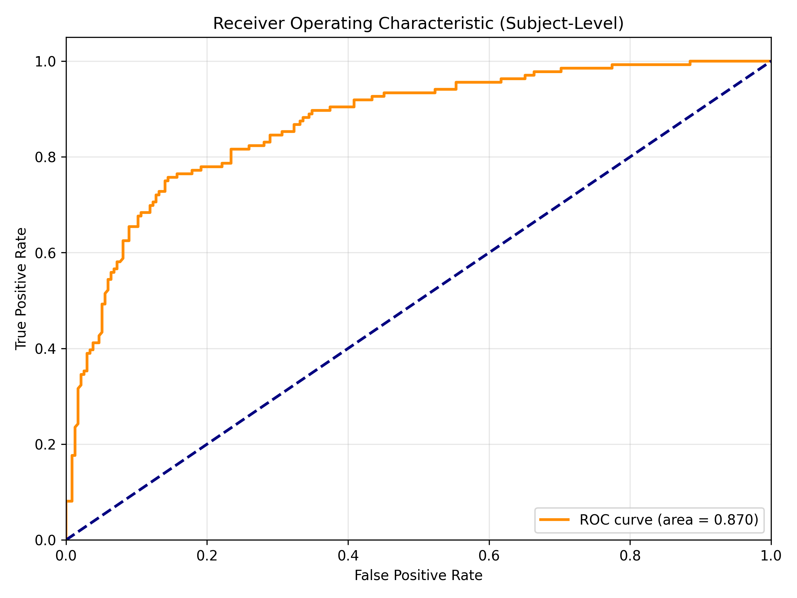
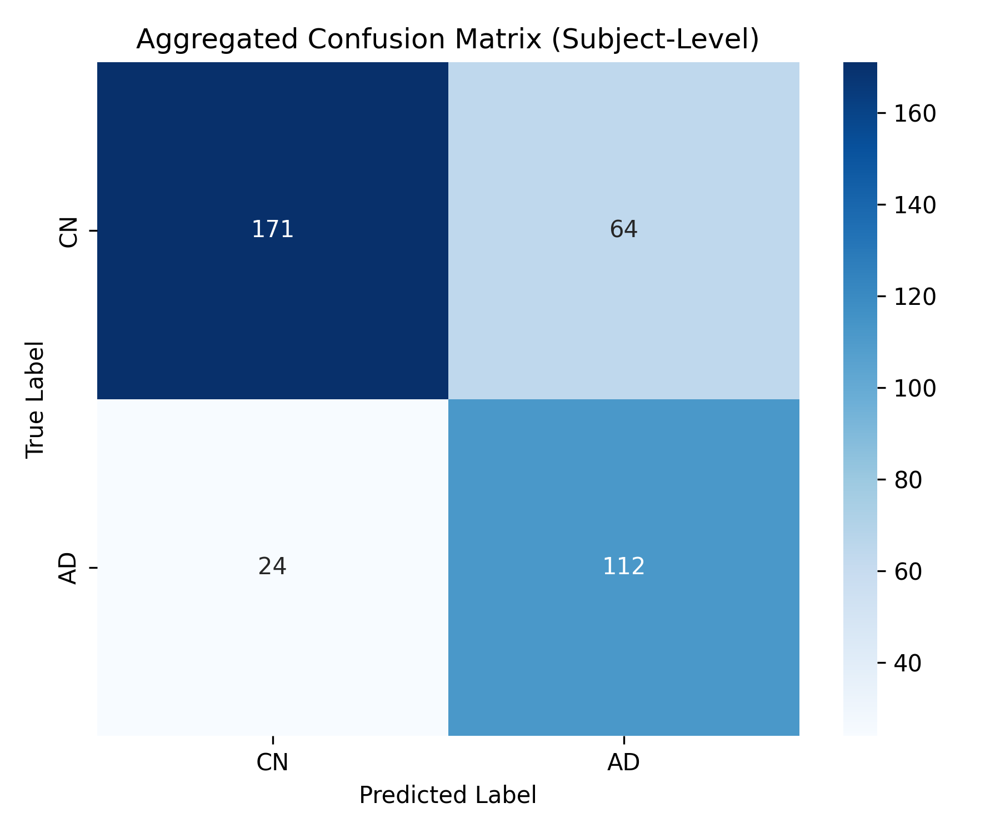
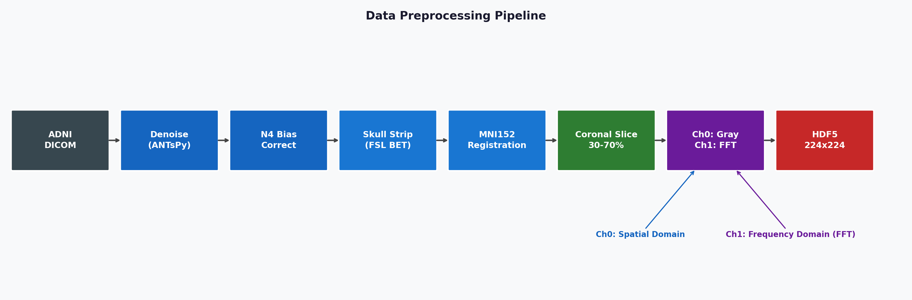
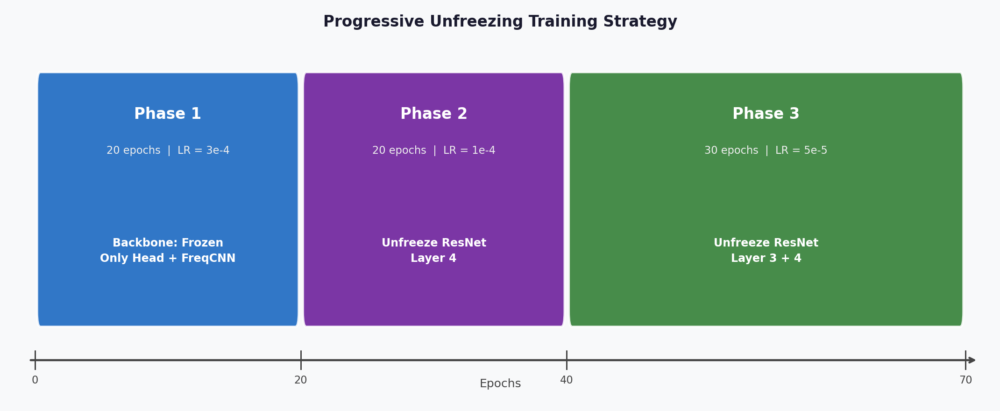

# DualDomainNet for Alzheimer's MRI Classification

DualDomainNet is a deep learning pipeline for binary Alzheimer's disease classification from ADNI MRI slices. The model combines spatial image features from an ImageNet-pretrained ResNet50 with frequency-domain features extracted from FFT log-magnitude images.

> Data note: raw ADNI MRI data, extracted HDF5 slices, subject identifiers, and trained checkpoints are not redistributed because ADNI data is governed by a data use agreement.

## Project Highlights

- Task: classify cognitively normal (CN) vs Alzheimer's disease (AD)
- Data representation: preprocessed 2D coronal MRI slices
- Validation: 5-fold StratifiedGroupKFold with subject-level grouping
- Model: dual-branch spatial and frequency-domain neural network
- Training: progressive unfreezing, focal loss, mixed precision, weighted sampling
- Evaluation: slice-level validation plus subject-level probability voting

## Architecture



The spatial branch uses a ResNet50 backbone to learn anatomical image features. The frequency branch computes FFT log-magnitude representations and learns complementary texture/frequency cues. The fused representation is passed through batch normalization, dropout, and a two-class classifier.

## Results

Main 5-fold subject-level result:

| Metric | Mean ± SD |
|---|---:|
| Subject AUC | 0.8737 ± 0.0238 |
| Subject Accuracy | 0.7629 ± 0.0567 |
| F1 Score | 0.7569 ± 0.0567 |
| Sensitivity | 0.8249 ± 0.0462 |
| Specificity | 0.7300 ± 0.0879 |

Post-hoc temperature scaling and Youden thresholding improved decision balance:

| Metric | Mean ± SD |
|---|---:|
| TS AUC | 0.8686 ± 0.0277 |
| TS Accuracy | 0.8517 ± 0.0162 |
| TS F1 | 0.8373 ± 0.0212 |
| TS Sensitivity | 0.7702 ± 0.0617 |
| TS Specificity | 0.8980 ± 0.0244 |







## Training Pipeline





Training is organized into three phases:

1. Train the classification head and frequency branch.
2. Unfreeze ResNet layer4.
3. Unfreeze ResNet layer3 and layer4.

The script uses focal loss, AdamW, mixed precision, gradient clipping, early stopping, and subject-level voting.

## Repository Structure

```text
.
├── data/
│   └── README.md
├── docs/
│   ├── architecture_diagram.png
│   ├── pipeline_diagram.png
│   └── training_strategy.png
├── results/
│   ├── confusion_matrix.png
│   ├── cv_metrics_summary.png
│   └── roc_curve.png
├── src/
│   └── train_subject_cv.py
├── .gitignore
├── README.md
└── requirements.txt
```

## Usage

Install dependencies:

```bash
pip install -r requirements.txt
```

Run training with an authorized ADNI-derived HDF5 file:

```bash
python src/train_subject_cv.py --hdf5-path /path/to/adcn_slices.h5 --output-dir outputs/dualdomain_v6
```

Optional Weights & Biases logging:

```bash
python src/train_subject_cv.py --hdf5-path /path/to/adcn_slices.h5 --use-wandb
```

## Skills Demonstrated

- Medical image classification
- PyTorch model design and training
- Transfer learning with ResNet50
- FFT-based frequency-domain feature learning
- Subject-level grouped cross-validation
- Model calibration and threshold analysis
- Clinical metrics: AUC, sensitivity, specificity, F1

## Limitations

This repository is intended as a reproducible code and results showcase. Full reproduction requires authorized access to ADNI MRI data and the same preprocessing pipeline used to produce the HDF5 slice file.
